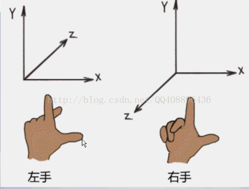
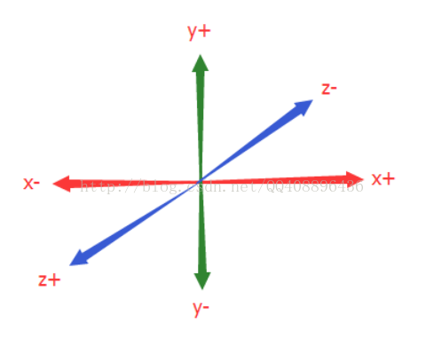
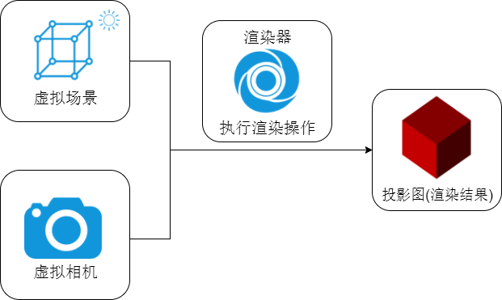
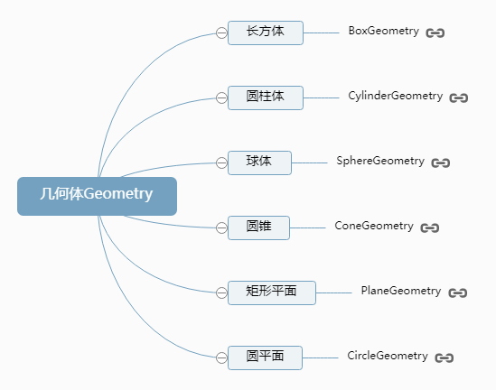
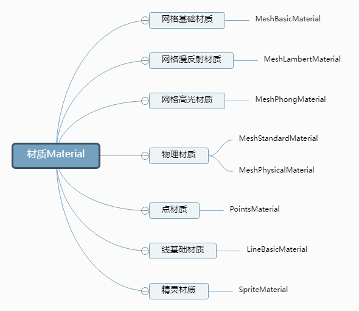
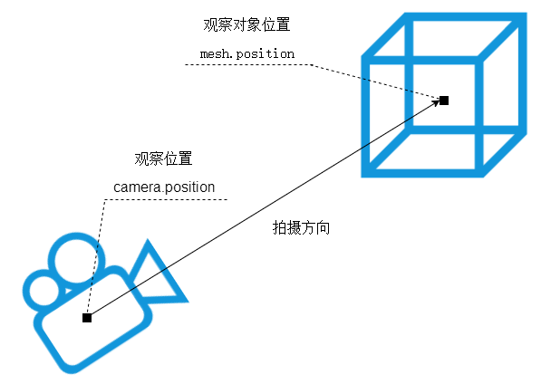

# 基础知识点


## 坐标系

### 左手坐标系和右手坐标系


三维坐标系分两种，左手坐标系和右手坐标系。如下图 ：



左手坐标系和右手坐标系的区别只是Z轴的方向不同而已。

而`threejs`中采用的是**右手坐标系**。




## 三维场景Scene

你可以把三维场景`Scene (opens new window)`对象理解为虚拟的3D场景，用来表示模拟生活中的真实三维场景,或者说三维世界。



```
// 创建3D场景对象Scene
const scene = new THREE.Scene();
```

## 物体形状：几何体Geometry

Three.js提供了各种各样的几何体API，用来表示三维物体的几何形状。



```
//创建一个长方体几何对象Geometry
const geometry = new THREE.BoxGeometry(100, 100, 100); 
```

## 物体外观：材质Material

如果你想定义物体的外观效果，比如颜色，就需要通过材质Material相关的API实现。

threejs不同材质渲染效果不同，下面就以threejs最简单的网格基础材质`MeshBasicMaterial (opens new window)`为例实现一个红色材质效果。




```
//创建一个材质对象Material
const material = new THREE.MeshBasicMaterial({
    color: 0xff0000,//0xff0000设置材质颜色为红色
}); 
```

## 物体：网格模型Mesh

实际生活中有各种各样的物体，在threejs中可以通过网格模型`Mesh (opens new window)`表示一个虚拟的物体，比如一个箱子、一个鼠标。

```
// 两个参数分别为几何体geometry、材质material
const mesh = new THREE.Mesh(geometry, material); //网格模型对象Mesh
//设置网格模型在三维空间中的位置坐标，默认是坐标原点
mesh.position.set(0,10,0);
// 将模型添加到scene中
scene.add(mesh); 
```

## 相机

Threejs提供了正投影相机`OrthographicCamera (opens new window)`和透视投影相机`PerspectiveCamera (opens new window)`。
正投影相机，物体大小不会因为角度或者远近改变，应用场景比如有3D模型的绘制。

比较常用的透视投影相机`PerspectiveCamera`，透视投影相机`PerspectiveCamera`本质上就是在模拟人眼观察这个世界的规律，成像会有近大远小的特征。



``` 
// 实例化一个透视投影相机对象
const camera = new THREE.PerspectiveCamera();
//相机在Three.js三维坐标系中的位置
// 根据需要设置相机位置具体值
camera.position.set(200, 200, 200); 
//相机观察目标指向Threejs 3D空间中某个位置
camera.lookAt(0, 0, 0); //坐标原点
camera.lookAt(mesh.position);//指向mesh对应的位置


```
### 透视相机  视锥体
透视投影相机的四个参数`fov, aspect, near, far`构成一个四棱台3D空间，被称为视锥体 ，
只有视锥体之内的物体，才会渲染出来，视锥体范围之外的物体不会显示在Canvas画布上。


> fov：	相机视锥体竖直方向视野角度	50
aspect:	相机视锥体水平方向和竖直方向长度比，一般设置为Canvas画布宽高比width / height	1
near:	相机视锥体近裁截面相对相机距离	0.1
far:	相机视锥体远裁截面相对相机距离，far-near构成了视锥体高度方向	2000


``` 
// width和height用来设置Three.js输出的Canvas画布尺寸(像素px)
const width = 800; //宽度
const height = 500; //高度
// 30:视场角度, width / height:Canvas画布宽高比, 1:近裁截面, 3000：远裁截面
const camera = new THREE.PerspectiveCamera(30, width / height, 1, 3000);

```

 
## WebGL渲染器WebGLRenderer

生活中如果有了景物和相机，那么如果想获得一张照片，就需要你拿着相机，按一下，咔，完成拍照。
对于threejs而言，如果完成“咔”这个拍照动作，就需要一个新的对象，也就是WebGL渲染器`WebGLRenderer (opens new window)`。

``` 
// 定义threejs输出画布的尺寸(单位:像素px)
const width = 800; //宽度
const height = 500; //高度
//设置three.js渲染区域的尺寸(像素px)
renderer.setSize(width, height); 
```

### 渲染器渲染方法.render()
渲染器`WebGLRenderer`执行渲染方法`.render()`就可以生成一个Canvas画布(照片)，
并把三维场景Scene呈现在canvas画布上面,你可以把`.render()`理解为相机的拍照动作“咔”。

### 渲染器Canvas画布属性.domElement
渲染器WebGLRenderer通过属性.domElement可以获得渲染方法.render()生成的Canvas画布，
.domElement本质上就是一个HTML元素：Canvas画布。
``` 
document.body.appendChild(renderer.domElement);
```

### Canvas画布插入到任意HTML元素中

```
// html:  
<div id="webgl" style="margin-top: 200px;margin-left: 100px;"></div>

// js:
document.getElementById('webgl').appendChild(renderer.domElement);
```

