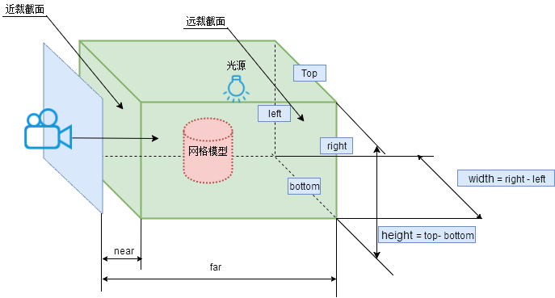
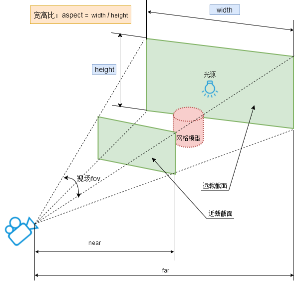

# 相机

## 相机分类

### 正投影摄像机
物体不会因为相机角度位置而改变大小
OrthographicCamera(left, right, top, bottom, near, far)

参数(属性)	含义
left	  渲染空间的左边界
right	  渲染空间的右边界
top	    渲染空间的上边界
bottom	渲染空间的下边界
near	  表示的是从距离相机多远的位置开始渲染，一般情况会设置一个很小的值。 默认值0.1
far	    表示的是距离相机多远的位置截止渲染，如果设置的值偏小小，会有部分场景看不到。 默认值1000

### 透视投影摄像机
成像有近大远小特征
PerspectiveCamera(fov, aspect, near, far)

<code src="./index.jsx" compact="true"></code>
